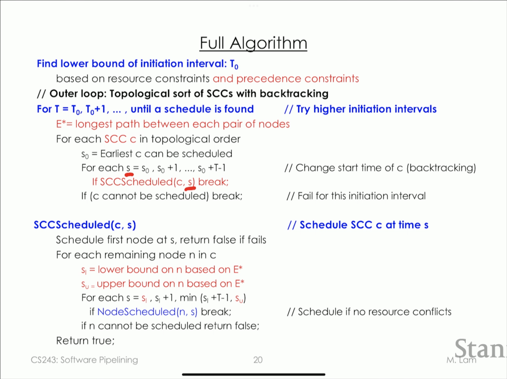

## Software pipelining

### Loop unrolling (for "DoAll" loops)

**Length of u iteration** = length of it + initiation interval (u - 1)
**Execution time per source iteration** = Length of u iteration / u → lim to ∞ = initiation interval

The wider the machine the more you unroll

### Software pipelined code

Unlike loop unrolling we always use the same schedule. That way you find an steady state.

**Execution time for pipelined code** = Steady state size * iterations + remaining operations.

**Initiation interval = size of steady state**

**Latency** = number of clocks for one iteration

**Throughput** == (1/Initiation interval) iteration/clock

### Basic Block Scheduling of the loo body

**Latency** = number of clocks for one iteration

**Throughput** == (1/number of clocks) iteration/clock

Usually with software pipelining you get worse latency but better throughput.

The locally compacted code may not be optimal, but we only care that the steady state is tight.

With "doAccross" loops there's a limit of how much you can parallelise the code.

### Resource constraints on Initiation Interval

> for all resource i
  number of units require by one iteration: ni
  number of units in system: Ri
  
> Minimum initiation interval (MII) = maxi ceil(ni/Ri)

### Precedence constraints on Initiation Interval

> for all cycles c,

> MII = maxc CycleLength(c) / Iteration difference(c)

This is based on:

Label edges with <𝛿, d>
* 𝛿 = iteration difference
* d = delay

Constraint for edge from n1 to n2 labeled <𝛿, d>
> 𝛿 * T + S(n2) - S(n1)  ≥ d

Cycles in the dependence graph mean that now you're bound on both ends. You can't stretch T arbitrarily 

### Algorithm for Acyclic graphs

Find lower bound of initiation interval: T0
  based on resource constraints

For T = T0, T0 + 1, ... until all nodes are scheduled
  For each node n in topological order
    s0 = earliest n can be scheduled
    for each s = s0, s0 + 1
      if NodeScheduled(n, s) break;
    if n cannot be scheduled break;
    
NodeScheduled(n, s)
  Check resources of n at s in modulo reservation table

If your loop is such that:
* Every operation uses only 1 resource
* There are no cyclic dependencies on the loop

**You can always meet the lower bound.** You just keep stretching the cycle until you pack them all in.

### Algorithm for Cyclic graphs

**Strongly connected component:** A set of nodes such that every node can reach every other node. Every node constraints all others from above and below. As each node is scheduled we find the lower and upper bounds of all other nodes in the SCC

SCC are hard to schedule. When you're working with the critical cycle (cycle lenght / iteration difference = T) you have **no slack**.

Edges between SCC are acyclic. So when backtracking we can move the SCC as a whole moving it's starting point. We can only try T times because on T + 1 we would be repeating so there's no point on keep trying.

SCC are scheduled in topological order, so sometimes this algo cannot generate the optimal pipeline if interleaving scheduling is needed between SCCs.

This algorithm works for acyclic graphs too.

### Modulo variable expansion

We have a problem when the lifetime of an operation that uses a register is greater than the initiation interval. Suddenly we created a dependency between the difference iterations.

The solution is to unroll the steady state to make it use different registers in each iteration.

If lifetime of r is greater than T you have an **artificial antidependency**

**Algorithm**

1. Schedule iterations ignoring artificial constraits on registers
2. Calculate life time of registers
3. Degree of unrolling = maxr (lifetimer / T). Take the max from all variables
3. Unroll the steady state of software pipelined loop to use different registers

Code generation
1. Generate one pipelined loop with only one exit (at beginning of steady state)
2. Generate one unpipelined loop to handle the rest of the code. 

